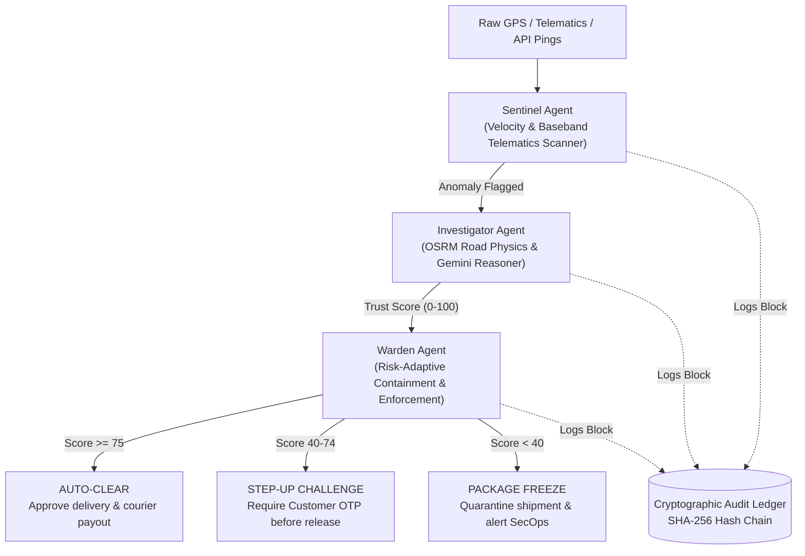

# AegisNode: Zero-Trust Verification for Last-Mile Logistics

> **GDEX x ANON x UTAR Agentic AI Cybersecurity Hackathon 2026**  
> **Track:** Secure Logistics & Digital Trust  
> **Team:** Syarafuddin, Aiman, Anis  
> **Cost to Build & Run:** **RM 0.00** (100% Free Stack)

---

## 1. Executive Summary

Logistics leaders like **GDEX** move tens of thousands of parcels daily across Malaysia. However, traditional last-mile logistics systems operate on **Blind Trust**: they trust the data sent from couriers' personal smartphones simply because the driver is authenticated.

This blind trust creates costly vulnerabilities:
1. **GPS Teleportation / Spoofing:** Drivers use mock-location apps to mark deliveries as complete without visiting the address, creating fake delivery records and customer disputes.
2. **Forged Proof-of-Delivery (POD):** Drivers photograph car floor mats, screens, or obscure corners to bypass visual confirmation.
3. **Subcontractor API Credential Abuse:** External 3rd-party logistics contractors scraping bulk manifest data out-of-hours (e.g., 3:00 AM data exfiltration).

**AegisNode** applies the **Zero-Trust Cybersecurity Framework ("Never Trust, Always Verify")** to physical and digital logistics events using an autonomous multi-agent pipeline.

---

## 2. Multi-Agent Architecture



### The 3 Core Agents:
1. **Sentinel Agent (Fast Scanner):**
   - Monitors kinematic speed between consecutive GPS pings ($v = \Delta d / \Delta t$).
   - Cross-references cellular baseband tower IDs (detects GPS teleportation where the cell tower stays locked).
   - Detects off-hours API burst scraping.
2. **Investigator Agent (Deep Reasoner):**
   - Queries OpenStreetMap OSRM routing engine to obtain actual driving road distances and realistic transit times.
   - Evaluates POD photo legitimacy and high-value cargo risk multipliers.
   - Synthesizes findings into a dynamic **Zero-Trust Score (0 to 100)** with human-readable forensic explanations.
3. **Warden Agent (Autonomous Enforcer):**
   - Replaces binary pass/fail with **Risk-Adaptive Countermeasures**:
     - $\ge 75$: Auto-clear delivery.
     - $40\text{--}74$: Dynamic Step-Up OTP Challenge sent to customer WhatsApp/SMS.
     - $< 40$: Immediate Package Freeze, driver session revocation, and security dispatch.
4. **Cryptographic Audit Ledger (ANON Cybersecurity Core):**
   - Computes SHA-256 Merkle/hash chains for every telemetry reading and agent intervention.
   - Guarantees **non-repudiation** so neither dishonest couriers nor compromised dispatchers can tamper with forensic evidence.

---

## 3. Quickstart & Installation (RM0 Cost)

### 1. Requirements
Ensure Python 3.10+ is installed on your machine.

### 2. Install Dependencies
```bash
pip install -r requirements.txt
```

### 3. Generate or Re-bake Datasets
```bash
python data/generate_telemetry.py
```

### 4. Run the Unit & Integration Test Suite
```bash
pytest aegisnode/tests
```

### 5. Launch the Command Center
```bash
python -m streamlit run aegisnode/app.py
```
Open your browser to `http://localhost:8501`.

---

## 4. Live Hackathon Pitch Script (7-Minute Winning Run)

| Time | Presenter Action | Spoken Narrative (Pitcher: Anis) |
| :--- | :--- | :--- |
| **0:00 - 0:45** | Show title screen on Streamlit | *"Good morning judges. Logistics companies like GDEX lose millions each year to last-mile delivery fraud and blind trust in driver GPS apps. We present AegisNode: Zero-Trust Verification for Last-Mile Logistics."* |
| **0:45 - 1:45** | Select **GPS Teleportation Spoofing** scenario & click **Analyze Now** | *"Here is shipment GDX-042 carrying an RM 1,850 smartphone. Watch the map. In the event log, the courier stops in an industrial park, and then suddenly jumps 15 km to Petaling Jaya in just 2 minutes."* |
| **1:45 - 2:30** | Point to **Sentinel Agent** bubble | *"Our Sentinel Agent immediately flags this: moving 15 km in 2 minutes requires 450 km/h. Crucially, baseband telematics reveal the phone stayed connected to the exact same cell tower in Shah Alam. The driver is using an Android GPS spoofing app."* |
| **2:30 - 3:45** | Highlight **Investigator Agent** & **Trust Score Gauge** | *"Next, the Investigator Agent queries the OpenStreetMap OSRM routing engine. Driving this route requires 26 minutes on the Federal Highway. The physical feasibility ratio is under 8%. As a result, the Zero-Trust Score collapses from 85 down to 18."* |
| **3:45 - 4:45** | Point to the **Warden Red Freeze Banner** | *"Because the score is in the critical red zone (<40), our Warden Agent autonomously intercepts: the package is frozen, the completion button is locked, and dispatch is notified before the parcel can be stolen."* |
| **4:45 - 5:30** | Click on the **Cryptographic Audit Ledger** dropdown | *"For our cybersecurity partner ANON: every telemetry ping, OSRM query, and Warden action is recorded into our SHA-256 cryptographic ledger. Couriers cannot tamper with the proof, guaranteeing non-repudiation for dispute resolution."* |
| **5:30 - 6:15** | Switch to **[NOMINAL] Normal Delivery** scenario | *"To prove zero false positives, here is a clean delivery. The route matches highway speeds, POD is verified, Trust Score reaches 100, and the Warden auto-clears the payout."* |
| **6:15 - 7:00** | Q&A Summary | *"AegisNode transforms GDEX from passive victim to an active, autonomous defender. Built on 100% free open-source tech. Ready for pilot deployment today. Thank you!"* |

---

## 5. Enhanced Command Center UI/UX Features

- **Cyber-Physical Glassmorphism SOC Design:** Modern dark theme (`#080D1A`), glowing status indicators, and live radar pulse (`ZERO-TRUST SURVEILLANCE ACTIVE`).
- **1-Click Quick Scenario Pills:** Instant switching between GPS Teleportation, Normal Delivery, POD Forgery, and API Scraping.
- **Physical Feasibility Kinematics Chart:** Grouped bar chart comparing OSRM expected road transit vs. courier logged time (instantly exposing impossible 7.7% feasibility ratios).
- **Proof-of-Delivery (POD) Visual Forensics:** Simulated optical viewfinder with AI vision anomaly scoring (88% fraud index), EXIF hardware fingerprinting, and customer OTP status.
- **API Threat Radar:** Real-time request surge monitor (520 req/min vs 60 threshold) and threat dossier for 3:00 AM data exfiltration attacks.
- **Live Courier Handset Preview:** Real-world smartphone screen mockup demonstrating driver app feedback (Verified Payout, OTP Challenge Lock, or Emergency Session Revocation).
- **Interactive Cryptographic Ledger & Tamper Demo:** SHA-256 Merkle chain visualizer with an interactive "Simulate Rogue Database Alteration" button proving instant non-repudiation for ANON.
- **Presenter Pitch Assistant:** Built-in 7-minute pitch cues and talking points for live stage presentations.

---

## 6. Technical Stack Breakdown

- **LLM / Reasoner:** Google Gemini 2.0 Flash (Free API tier / offline deterministic fallbacks)
- **Agent Orchestration:** Multi-Agent Cooperative Pattern (Sentinel $\rightarrow$ Investigator $\rightarrow$ Warden)
- **Map & Routing Engine:** OpenStreetMap OSRM (100% free, no API keys, with local fallback cache)
- **Zero-Trust Ledger:** Pure Python SHA-256 Hash Chaining
- **Dashboard:** Streamlit, Folium (interactive OpenStreetMap), Plotly (cyber speedometer & kinematics charts), Pandas

